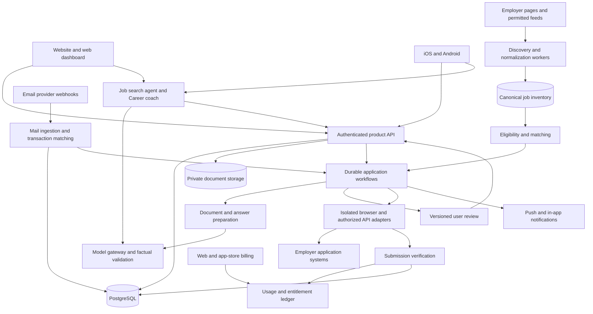

# Jobluvo, High-level implementation plan

Version 0.3, 12 September 2026. Engineering proposal, not a committed delivery estimate. Updated for the dashboard redesign, lanes, agents, plan entitlements and the marketing site; see [Dashboard mockup](03-Dashboard-Mockup.html), [Website](05-Website.html) and [ATS integration plan](04-Job-Parsing-and-ATS-Integration.md).

Requirements baseline: [Product BRD](01-Product-BRD.md)

## 1. Engineering strategy

Build one shared service for discovery, profile facts, application preparation, execution, mail and billing. Deliver a responsive web product and iOS/Android clients around it. Keep long-running automation outside client devices so users can close the app without stopping applications.

Start with a modular backend and independently scalable worker pools. Do not begin with dozens of microservices. The application runner and untrusted content processing need stronger isolation than ordinary account and dashboard requests.

Resolve four feasibility questions before substantial client polish:

1. Can we discover useful US jobs with measurable freshness and affordable source access?
2. Can we submit accurately on the initial destinations, including account/verification flows?
3. Can we operate professional application addresses and preserve employer-account continuity?
4. Can measured cost per verified application support lower pricing and higher allowances?

## 2. Proposed architecture



The diagram represents logical responsibilities. Several modules initially live in the same deployable API service. Document storage, job inventory and user/application tables can share managed infrastructure while maintaining access boundaries.

## 3. Recommended technology baseline

These are proposed implementation choices; pin supported versions during the first engineering phase.

| Layer | Proposal | Reason |
|---|---|---|
| Web | Next.js with TypeScript | Public site (home, how it works, pricing, blog, FAQ, auth) and authenticated dashboard sharing tokens and components. Dashboard: top navigation above 900px, bottom tab bar and agent sheet below it. Blog content in Markdown with a comparison template |
| Mobile | React Native with Expo | One iOS/Android codebase with platform-specific review, gestures and notifications where needed |
| Backend | TypeScript modular service, e.g. NestJS | Shared validation and contracts with clients and automation workers |
| Primary data | Managed PostgreSQL, initially with full-text search and vector support | Transactions, canonical jobs, profiles, audit events and early search |
| Orchestration | Temporal or equivalent durable workflow engine | Reviews and verifications may pause for hours; work must survive restarts |
| Browser execution | Playwright workers in isolated containers | Explicit page actions, form adapters and captured evidence |
| AI | Provider-neutral gateway with structured generation and model routing | Control cost, evidence, retries and model upgrades |
| Document storage | Private S3-compatible object storage | Immutable versions, signed downloads and lifecycle rules |
| Email | Managed inbound/outbound domain provider; Resend is a candidate | Webhook-based inbound ingestion; vendor approval and reply/deliverability pilot required |
| Payments | Web payment provider plus iOS/Android purchase integrations | Centralized entitlements independent of where the subscription was purchased |
| Operations | Structured logs, traces, error reporting and cost metrics | Follow one application through every stage and diagnose failures |

Expo documents a shared app development platform; Temporal provides durable workflow abstractions; Playwright provides independent browser contexts. Context isolation is useful, but container, secret, process and network isolation are additional production requirements. [Expo](https://docs.expo.dev/), [Temporal workflows](https://docs.temporal.io/workflows), [Playwright isolation](https://playwright.dev/docs/browser-contexts)

### Suggested repository structure

```text
apps/web                 public site and web dashboard
apps/mobile              iOS/Android app
apps/api                 product API and provider webhooks
workers/discovery        source fetching and normalization
workers/preparation      extraction, matching and document rendering
workers/applications     browser execution and verification
packages/contracts       schemas and typed API contracts
packages/domain          business rules, policies and state transitions
packages/connectors      ATS discovery/execution adapters
packages/agents          agent definitions, tool schemas and preview/approve flow
packages/design          tokens and shared interaction specifications
packages/evaluations     fixtures and factual/reliability benchmarks
infra                    environments, deployments and monitoring
```

Share contracts, validation, domain logic and visual tokens. Do not force every mobile and web screen into a single UI implementation if it compromises the swipe/review experience.

## 4. Discovery and source strategy

### Initial source families

| Source | Discovery approach | Submission approach / constraint |
|---|---|---|
| Greenhouse | Public board listing/detail endpoints for known employer boards | Hosted form automation; API submission only with appropriate employer authorization |
| Lever | Documented posting feeds for known employer sites | Hosted form automation; POST API needs an employer-issued key |
| Ashby | Public job posting API for known boards | Hosted application flow; public listing availability does not establish submission API rights |
| Workday | Evaluate supported public employer career flows per configuration | Dedicated browser adapter with early feasibility spike; do not assume a general public apply API |
| Other ATSes | Capability and access review per source | Expand on measured demand and reliability |
| LinkedIn/other aggregators | Authorized data feeds or user-supplied references resolved to independent employer jobs | Native submission only with an appropriate authorized route; otherwise explicit manual handoff |

Greenhouse documents public GET access but requires authentication for submission. Lever likewise documents an employer-generated key for POST applications. These prevent the assumption that public job feeds allow unrestricted API application submission. [Greenhouse Job Board API](https://docs.greenhouse.io/job-board.html), [Lever postings API](https://github.com/lever/postings-api)

Ashby's public feed can provide structured listings and destination links; treat it as discovery infrastructure and validate execution separately. [Ashby public posting API](https://developers.ashbyhq.com/docs/public-job-posting-api)

### Source registry and coverage

The registry must store employer identity, board token/site URL, access method, policy/access review state, source family, refresh interval, allowed concurrency, last successful fetch, health and active job count.

Seed a pilot registry from curated US employers and permitted directories/feeds; add user-suggested companies through validation. Growing from hundreds to thousands of employers is its own ingestion task. Possessing an ATS adapter does not automatically provide every employer board token or complete US coverage.

Measure inventory by occupation, seniority, geography, employer size and source family. Greenhouse/Lever/Ashby-heavy inventory may skew toward some professional roles; fill observed coverage gaps before claiming that the product serves all job categories equally.

### Pipeline

1. Schedule source checks by permitted rate and expected change frequency.
2. Fetch structured data when available; otherwise parse a supported public page.
3. Preserve a restricted raw snapshot/hash for debugging and provenance.
4. Normalize role, locations, pay and eligibility signals into a canonical schema.
5. Link syndicated copies to one requisition where evidence supports it.
6. Store posting/first-seen/last-checked times separately.
7. Emit new/changed/closed events and match only affected campaigns.
8. Refresh active postings and confirm availability before final submission.

Use conditional requests and incremental processing when the source supports them. Poll priority sources initially every 2–5 minutes and long-tail sources every 15–60 minutes only where allowed and affordable; these are tuning assumptions, not universal promises. Use events/webhooks when a partner actually provides them.

Scale illustration: 5,000 boards checked every five minutes means approximately 1.44 million checks/day before pagination and details. Fetching once per source and matching across users is essential. Never run a separate full crawler for every subscriber.

“Real time” must have an operational definition: detection lag by source class, then processing and queue delay. Do not claim instant detection everywhere, that every role is new, or an exact applicant rank without evidence.

## 5. Candidate data and matching

Use typed extraction plus human confirmation to establish a factual profile. Each reusable fact has an origin (uploaded file, user entry, approved edit), verification status and version.

Matching stages:

1. Cheap hard filters for geography, employment type, exclusions, authorization requirements and known must-have qualifications.
2. Retrieval using normalized titles, skills and semantic similarity.
3. Selective detailed ranking only for plausible candidates/jobs.
4. Explainable results containing evidence, unknowns and missing requirements.
5. User feedback updates ranking weights; hard constraints require explicit edits.

Store missing salary or sponsorship as unknown. Keep hourly and annual compensation units explicit; any normalized annual estimate must preserve its hours assumption. US-remote work is not automatically work-from-any-country. Avoid inferring sensitive user attributes from names or resume text.

## 6. Document and answer generation

Create a typed application packet from the job snapshot, verified profile version, chosen resume base and answers. The model may propose phrasing and selection of facts; validators enforce that employment, dates, qualifications, numbers and authorization answers remain supported.

Generation flow:

1. Extract requirements and identify supporting candidate evidence.
2. Prepare a structured resume/letter/answer representation.
3. Validate facts, required answers, lengths and unsupported assertions.
4. Render document variants and validate text extraction/layout.
5. Present an actual diff and exact files for review when required.
6. Store immutable packet version and approval hash.

Cache reusable work by job, profile, resume, template, policy and model versions. A profile correction invalidates dependent drafts. Do not reuse an old approval simply because a new file has the same visible filename.

“ATS compatibility” means readable formatting and appropriate content checks, not a guarantee of passing an employer's screening algorithm.

## 6a. Agents

Two agents ship in the product, both built on the same model gateway and the same tool layer, differing in system instructions and tool scope.

| Agent | Reads | Can propose | Never does |
|---|---|---|---|
| Job search agent | Profile, feed, lanes, queue, receipts, match explanations | Lane filter and instruction changes, exclusions, company lists, a review of a prepared packet, feed re-ranking | Submit, loosen hard filters, change authorization answers |
| Career coach | Profile, saved jobs, rejections, inbox, target roles | Skill and certification suggestions, resume section rewrites from verified facts, outreach drafts, interview prep plans | Send messages, edit verified facts, apply |

Design rules:

1. Every proposal is a typed change object rendered as a preview in the same UI where the user would make the change by hand. Nothing is applied until the user confirms.
2. Tools are read-only except for creating proposals and drafts. The agent layer has no direct write path to lanes, profile facts or the submission workflow.
3. Each agent keeps its own conversation history per user. Conversations reference entities by id so answers can link back to the lane, job or message they used.
4. Untrusted text (job descriptions, emails) reaches agents only as data inside structured fields, with the same injection guards as the rest of the system.
5. Cost: default to a smaller model for classification and retrieval steps and reserve the larger model for the final answer. Cap tokens per turn and per day per user.
6. Entitlement: agent endpoints check the subscription tier. Free-trial accounts get no model calls from the agent layer; the client shows a static explanation and an upgrade prompt. This keeps unpaid accounts at near-zero inference cost.

## 7. Application orchestration and state

### Execution states

```text
SELECTED → VALIDATING → PREPARING → READY_FOR_REVIEW → QUEUED
         → RUNNING → VERIFYING → SUBMITTED

Possible branches:
NEEDS_INPUT · NEEDS_LOGIN · NEEDS_VERIFICATION · NEEDS_CHALLENGE
RETRY_SCHEDULED · VERIFICATION_PENDING · FAILED · CANCELED · EXPIRED · UNSUPPORTED
```

Automatic policy can bypass READY_FOR_REVIEW only when all relevant permissions and document policies permit it. New destination fields can move RUNNING back to NEEDS_INPUT/READY_FOR_REVIEW.

Maintain a separate hiring stage: Applied, Employer replied, Interview, Offer, Rejected, Withdrawn, or user-defined notes. A completed browser workflow does not imply employer interest.

### Adapter interface

Each destination adapter should implement capabilities equivalent to:

```text
identifyDestination / inspectPosting / inspectForm
establishSession / prepareFields / uploadDocuments
validatePreparedState / submit / collectEvidence / reconcileResult
```

Return typed field schemas, unsupported elements and evidence. Prefer tested mappings for known forms; use constrained model-assisted interpretation for unfamiliar labels, followed by validation. A free-roaming agent is not the only execution mechanism.

### Lanes and the shared cap

A lane is a named automation policy: resume profile, filters, standing instructions, minimum match quality, review-before-submit flag, tailoring level, cover letter policy and application email. An account holds up to five. Selection runs several times a day over jobs first seen in the last 24 hours:

1. For each active lane, apply hard filters, then the lane's match bar, then the standing instructions as an exclusion-only check.
2. Merge candidates from all lanes, deduplicate by canonical requisition (a job that qualifies for two lanes goes through the higher-scoring lane), and order by match score.
3. Reserve from the shared daily cap in that order until it is exhausted. The remainder waits for the next run or the next day; it is never sent in a lower-quality form to use up the cap.
4. Lanes with review-before-submit hold prepared packets in READY_FOR_REVIEW on destinations that support pausing and tell the user which destinations do not.
5. The Jobs feed excludes anything a lane has selected, so the user only sees what is left.

The seven-day preview reuses the same selection code against the last seven days of inventory without reserving cap, so the preview and the real run cannot disagree.

### Submission commit protocol

1. Acquire a unique workflow lease for user + canonical requisition.
2. Recheck cancellation, mode authorization, packet version and job availability.
3. Reserve allowance with a unique ledger reference.
4. Persist a submission intent before the external side effect.
5. Execute the final action once for that intent.
6. Collect confirmation evidence and settle success atomically in internal records.
7. If the result is uncertain, reconcile first; never blindly repeat Submit.

A database transaction cannot make an external employer form exactly-once. The design instead minimizes duplicates using leases, intent records, idempotent internal handling and evidence-based reconciliation. A crash after the employer accepts a form is a first-class test case.

Pause cancels pending commits but cannot reverse one already accepted by the employer. Show this boundary clearly. Approval waits should release browser capacity when possible; a resumed session must revalidate the form and packet.

Challenge handling uses explicit user handoff. Do not budget on guaranteed CAPTCHA bypass, unlimited employer sessions, or universal cloud-browser compatibility.

## 8. Managed email and account continuity

Separate the user's Jobluvo sign-in identity, their application email alias and their employer-specific accounts. These are not interchangeable.

### Build sequence

1. Select and verify an owned mail domain with the provider; confirm its acceptable-use fit for managed applicant inboxes.
2. Configure receiving and sending DNS, provider webhook verification and domain reputation monitoring.
3. Allocate aliases transactionally, with collision/reserved-name handling and verified ownership inside Jobluvo.
4. Persist inbound messages and metadata idempotently using provider IDs/message IDs.
5. Sanitize content, scan attachments, thread by message references and link to application candidates.
6. Resolve OTPs only against an active expected verification transaction; keep codes out of general logs and model prompts.
7. Send user-approved replies with proper threading headers and record delivery/bounce outcomes.
8. Implement export, cancellation continuity, retirement and deletion policies.

A provider's inbound webhook is a transport primitive, not a complete mailbox product. Test professional-domain acceptance on employer portals, delayed/duplicate mail, aliases with identical names and account-recovery flows. Do not reuse retired addresses.

Receiving on a custom domain uses domain verification, MX configuration and webhooks. Sending can use addresses on a verified domain, but Jobluvo must enforce which user can use each sender. [Resend receiving](https://resend.com/docs/dashboard/receiving/custom-domains), [Resend sender setup](https://resend.com/docs/knowledge-base/how-do-I-create-an-email-address-or-sender-in-resend)

Existing Gmail/Outlook integration is a separate provider-approval and OAuth workstream. Confirm scopes and verification requirements before committing its rollout; retain the managed inbox as an independent path.

## 9. Main data entities and API boundaries

| Entity | Important relationships / purpose |
|---|---|
| User / AuthIdentity | Account, verified recovery identity, devices and consent records |
| CandidateProfile / ProfileFact | Versioned factual background, provenance and explicit answers |
| ResumeVersion / Document | Original and generated artifacts with hashes and private storage keys |
| Lane / AutomationPolicy | Named per-lane rules; the account-level shared daily cap and master Auto Apply toggle live on the user's entitlement record |
| AgentConversation / AgentProposal | Per-agent history and typed proposed changes with their approval state |
| Employer / Source / ConnectorVersion | Source registry, refresh state and capability map |
| Job / JobSnapshot / JobLocation | Canonical identity, time-versioned content and multiple locations |
| Match / SwipeDecision | Fit explanations, selected/skipped/saved intent and feedback |
| Application / Attempt / SubmissionIntent | Durable lifecycle, external-action boundary and retry history |
| ApplicationPacket / Approval | Exact answers/documents and authorization binding |
| EmployerAccount / SecretReference | Credentials and sessions stored through a vault, not ordinary plaintext fields |
| MailboxAlias / Email / Thread | Generated address allocated at sign up, forwarding target, communication history and associations |
| VerificationChallenge | Expected employer, transaction and expiry for codes/links |
| Subscription / Entitlement / UsageLedger | Purchase channel (Starter, Pro, Max; monthly, quarterly, annual), reservations, settlement, refunds and feature flags such as agents and Auto Apply |
| Receipt / AuditEvent / Notification | Evidence, change history and actionable updates |

API areas: identity/profile, discovery/search, swipe decisions, lanes, agents, document review, application actions/status, inbox/replies, subscriptions/usage, notifications and support. Mutations accept idempotency keys and optimistic version checks where needed. Provider webhooks have separate authenticated endpoints and replay protection.

## 10. Security and reliability boundaries

The product handles resumes, job-search intentions, employer credentials and private correspondence. Implement the following as concrete architecture requirements:

- Tenant-scoped queries, private object access and cross-user access tests.
- Secret vault references with short-lived worker access; encrypted session artifacts and bounded retention.
- Isolated browser workers with validated destinations, controlled network egress and blocked internal metadata/private-network access.
- Sanitized email/HTML and scanned uploads; signed, deduplicated provider events.
- Strict separation between untrusted page/email text and system instructions; prohibit data-driven tool permission changes.
- Structured redacted telemetry; do not log passwords, OTPs, full private messages or token-bearing URLs.
- Audited support access, narrowly scoped diagnostics and per-connector kill switches.
- Account deletion that stops workflows, revokes provider access, purges primary personal data and schedules backup expiry.

Do not claim compliance certifications or a specific legal compliance status based on these controls. Provider contracting and launch-market requirements are separate release work.

## 11. Phased delivery and dependencies

Planning envelope: roughly **16–24 weeks** for a limited-coverage public release with a dedicated team of about four to six engineers plus product/design and QA support. This is a directional estimate, not a promise. Broader ATS coverage, provider approval, challenge handling, email deliverability and app review can extend it. A solo effort needs a materially smaller scope or longer schedule.

The dates below overlap where work is independent; the phase exit gates determine actual progress.

| Phase | Indicative window | Deliverables | Exit gate / BRD mapping |
|---|---|---|---|
| 0. Feasibility and decisions | Weeks 1–2 | Candidate profile schema; source registry pilot; one discover→prepare→submit slice; Workday spike; domain/mail proof; observed cost worksheet; dashboard mockup (done) and onboarding/review prototype | Demonstrate truthful submission evidence in authorized test scenarios; settle email and mode semantics. ID, JOB, DOC, APP, MAIL |
| 1. Foundation and discovery | Weeks 3–5 | Monorepo, environments, auth, profile import/review, candidate truth store, three discovery families, US normalization, matching, initial web/mobile shells | Users receive relevant deduplicated jobs with explicit unknowns. ID-01–07, JOB-01–09 |
| 2. Reliable career engine | Weeks 4–9 | Durable workflow, packet generation/diffs, initial submission adapters, account/session handling, receipts, review and unknown-result reconciliation | Retry/approval/duplicate benchmark passes; costs measured per destination. DOC-01–06, APP-01–10 |
| 3. Complete client experience and mail | Weeks 6–12 | Production List and Swipe views, accessible controls, lanes and shared cap, Job search agent and Career coach with preview/approve, separate Inbox and Tracker, OTP handling, push, resume editor, responsive top/bottom navigation and cross-device sync | End-to-end targeted and autonomous journeys on web/iOS/Android. UX, MAIL, TRK |
| 4. Paid closed beta | Weeks 11–16 | Billing and entitlements (three tiers, three periods, agent and Auto Apply flags), cost gates, support/admin, source expansion, validated Workday configurations, existing inbox integration where approved, public site and blog live | Real opted-in pilot shows reliability and viable full-usage pricing. BILL, OPS |
| 5. Public release hardening | Weeks 16–24 | Performance, privacy/lifecycle checks, restoration drills, app review, support coverage, honest public capability matrix and release monitoring | All BRD release acceptance criteria satisfied for advertised scope |
| 6. Expansion | After core gates | Additional ATS adapters, extension, recruiter discovery/outreach drafts, public portfolio, tested referral loop | Prioritize measured demand, incremental reliability and unit economics |
| 7. Regional/local execution | Later | LATAM language/inventory/pricing; separately evaluate signed desktop runner | Explicit market/local-runner brief and threat/cost review |

The first slice should submit through one validated destination before investing in extensive social features. Native app work still begins early; it is not postponed until after a web-only launch.

### Recommended team responsibilities

| Responsibility | Main ownership |
|---|---|
| Backend/workflows | Identity, policies, ledger, state, mail and product API |
| Automation/integrations | ATS adapters, sessions, challenges, evidence and connector health |
| Data/AI | Discovery, normalization, matching, factual generation and evaluation |
| Web/mobile | Shared contracts, responsive dashboard, swipe/review/inbox clients, agent panel and accessibility |
| Product/design + QA support | Interaction semantics, acceptance scenarios, pilot feedback and release checks |

One engineer can cover multiple areas, but shared ownership does not eliminate the workload. Keep someone accountable for ongoing connector breakage after launch.

## 12. Validation plan

| Test area | Representative cases |
|---|---|
| US parsing | Multi-state jobs, US-only remote, remote global, missing pay, hourly ranges, conflicting locations, sponsorship unknown |
| Factual generation | Sparse resume, conflicting dates, unsupported JD skills, invented numerical results, sensitive questions |
| Forms | Multiple employer configurations, optional/required fields, dropdowns, long text, file limits, account creation/login |
| Consent | Changed resume after approval, new screening question, turning Auto Apply on with queued swipes, pause during queue, revoked authorization, agent proposal applied only after confirmation |
| Lanes | Same job qualifying for two lanes, cap exhausted mid-run, lane paused mid-run, preview versus real run parity, review hold on a non-pausing destination |
| Reliability | Worker crash before/after Submit, delayed confirmation, duplicate request, expired session, source layout change |
| Mail | Spoofed sender, unrelated OTP, duplicate webhook, attachment threat, bounce, threading, retired alias |
| Payments | Duplicate webhook, restore purchase, multi-channel subscription, refund after usage, reservation timeout |
| Clients | Offline swipes, stale review, simultaneous devices, accessibility, slow networks, background/resume |
| Security | Cross-user record/file/mail access, prompt injection, malicious job links, leaked secrets, staff audit trail |
| Operations | Connector kill switch, queue overload, provider outage, backup restore, account deletion |

Use deterministic fixtures and controlled employer/test environments for repeatable automation tests. Live validation uses participating employers or actual opted-in users applying to genuine suitable roles; do not flood employers with synthetic applications.

Publish benchmark denominators: discovered roles, eligible roles, supported destinations, attempted submissions, successes, challenges, unsupported cases and unknown outcomes. Reporting only the easiest successful runs would hide product risk.

## 13. Cost and scale plan

Instrument costs from the first feasibility slice, before choosing launch caps.

Track model tokens/cost, browser seconds, navigation retries, verification wait, storage, source polling, inbox traffic, payment/store deductions and support time. Include failed attempts in cost per verified submission.

Cost controls:

1. Discover each source once for all users; process only changed jobs.
2. Apply hard filters before expensive ranking and generation.
3. Use smaller models for extraction/classification when evaluation supports them.
4. Cache approved reusable content without mixing user data or stale versions.
5. Prefer deterministic form mappings and authorized APIs over repeated model-driven browsing.
6. Release idle browser resources during long review/OTP waits where safe.
7. Bound retries and suspend unhealthy configurations automatically.
8. Queue fairly by campaign budgets and age; avoid letting large plans starve ordinary users.

Capacity example, not a demand forecast: 10,000 users making 20 applications/day means 200,000 applications/day. At 60 active browser seconds each, that is roughly 139 continuously busy browser slots at a perfectly even load, before retries and peak headroom. Fifty percent utilization would require roughly 278 slots. Keeping forms open while users review can increase this sharply.

Approve plan allowances against both average and adverse user mixes: full allowance consumption, slow ATSes, low success rates and high support load. If the target economics do not work, change the delivery mix or pricing before advertising it.

## 14. Material risks and responses

| Risk | Engineering/product response |
|---|---|
| Cheaper high-volume plans lose money | Early cost benchmark; full-usage margin gate; bounded retries; no uncosted unlimited promises |
| “Everyone” exceeds initial inventory | Coverage breakdown by occupation/geography; targeted source expansion; explicit availability |
| Form variation breaks automation | Per-configuration fixtures, adapter versions, staged enablement and kill switches |
| Public APIs cannot submit for users | Browser flows where supported; partner authorization for protected APIs; separate discovery/execution coverage |
| LinkedIn access unavailable | Resolve independent employer postings and provide honest manual handoff |
| Domain mail has poor acceptance | Deliverability pilot, existing-email option, domain health and continuity policy |
| Phone/CAPTCHA/account challenges | User handoff with resumable workflow and visible completion limits |
| AI misstates qualifications | Verified facts, evidence-linked generation, blocking validators and approval gates |
| User accidentally applies | Clear mode semantics, cancellation window, versioned review and duplicate protection |
| Swipe feature lacks differentiation | Test match quality, review speed and outcome usefulness; use engagement experiments with success metrics |
| Store/provider approvals delay launch | Start accounts, scopes and purchase-flow review early; keep dependent releases gated |

## 15. First development backlog

The initial implementation sprint should produce the following concrete outputs:

1. Record architecture decisions for cloud execution, email domain, automation modes and submission commit semantics.
2. Establish the repository, CI, development/staging environments and shared schemas.
3. Implement candidate facts, job snapshots, campaign policies, application packet and ledger schemas.
4. Build a small US employer source registry and ingest Greenhouse/Lever/Ashby jobs with normalized locations and timestamps.
5. Turn the dashboard mockup into the web shell (navigation, agent panel, List and Swipe views, lanes, Inbox, Tracker) and build the onboarding, review and receipt prototype using realistic empty/error states.
6. Generate one evidence-grounded application packet and render its reviewable resume.
7. Complete one authorized end-to-end destination flow with a persisted receipt.
8. Allocate a test alias on an owned domain, receive a message and resolve an expected verification challenge.
9. Inject a timeout after submission and demonstrate no blind retry or duplicate charge.
10. Produce measured feasibility and unit-cost results, then update scope, staffing and price experiments.

The first engineering gate is evidence that the core automation and economics can work. The public-release gate remains the full website + iOS + Android experience defined in the BRD.
